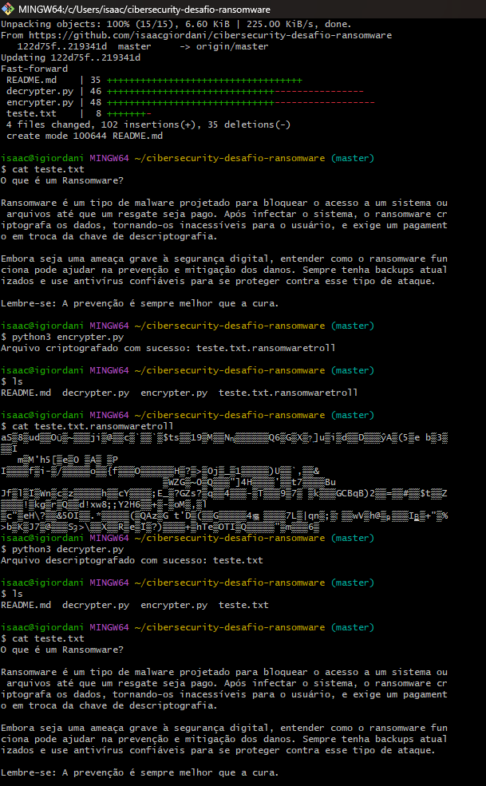

<h1>
    <a href="https://www.dio.me/">
     </a>
    <span> Cibersegurança - Criptografia e Descriptografia de Arquivos</span>
</h1>

[](https://shields.io)
[](https://www.python.org/)

## Sobre o Projeto

Este laboratório tem como objetivo demonstrar a implementação de um sistema básico de **criptografia** e **descriptografia de arquivos** utilizando o algoritmo **AES (Advanced Encryption Standard)** no modo **CTR (Counter Mode)**. O código simula um ataque de **"ransomware"** para fins educativos, criptografando e descriptografando arquivos com uma chave compartilhada.

## Arquivos

1. **encrypter.py** - Script para criptografar um arquivo usando AES no modo CTR.
2. **decrypter.py** - Script para descriptografar um arquivo criptografado pelo `encrypter.py`.
3. **teste.txt** - Arquivo de texto simples que será criptografado e descriptografado durante os testes.

## Funcionalidade

- O **`encrypter.py`** lê um arquivo de texto simples, o criptografa usando uma chave simétrica e o salva com um novo nome de arquivo com a extensão `.ransomwaretroll`.
- O **`decrypter.py`** lê o arquivo criptografado, o descriptografa usando a mesma chave e o restaura ao formato original com o nome do arquivo original.

## Requisitos

- **Python 3.x** - A versão mais recente do Python.
- **pyaes** - Biblioteca Python para criptografia AES.

### Instalando dependências

Para garantir que todas as dependências sejam instaladas, execute o seguinte comando:

```bash
pip install pyaes


